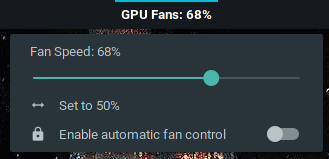
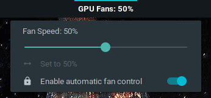

# GPU Fan Control Applet

This applet controls fan speed via `/sys/class/hwmon/hwmon$id/pwm1`, where the id is provided from settings.  
It expects manual fan control to already be enabled, and for the current user to have write privileges on the files in the hwmon folder.  
Check if the correct device is used by hovering on the applet (eg `hwmon name: amdgpu` for AMD GPUs).

[hwmon sysfs Reference](https://www.kernel.org/doc/Documentation/hwmon/sysfs-interface)  
[Cinnamon JS Reference Manual](http://lira.epac.to:8080/doc/cinnamon/cinnamon-js/)  
[Cinnamon JS Source](https://github.com/linuxmint/Cinnamon/blob/master/js/)
